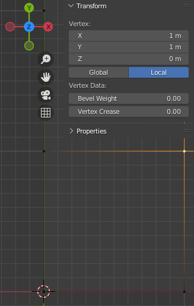

# Blender Mesh to RAW file Exporter

Exports your selected object's mesh as a heightmap file in the formats
* `.raw`
  * bit depth: 16, 24 or 32 (unsigned integer value)
  * endianness: little or big
* OpenEXR (32-bit float)

Tested import with the following heightmap terrain engines
* [Zylann's Heightmap Plugin](https://github.com/Zylann/godot_heightmap_plugin)

**Why this Add-on?**  
The most common method to create a heightmap in Blender is to use the camera in ortographic mode and render to a 16-bit PNG, like so: https://blender.stackexchange.com/questions/154864/how-can-an-accurate-height-map-be-created-in-blender/154900#154900  
But not everybody supports 16-bit PNG (e.g. [Godot does not](https://github.com/godotengine/godot/pull/19497)).  
Then there's the the full (32-bit; not necessarily supported in target platform) or single channel half (16-bit) precision floating-point method using [_OpenEXR_](https://blender.stackexchange.com/questions/191253/how-to-render-height-map-in-blender), where you'll have to know if your target platform needs floats in the range of 0..1 or real height values (in meters). You could later remap e.g. 0..1 to real heights, but the precision loss there is not acceptable. Precision loss often results in _stepping artifacts_.  
And then you have to be careful of Blender's color management: the color space needs to be linear, not e.g. sRGB. And use the correct [map height value](https://github.com/Zylann/godot_heightmap_plugin/issues/90#issuecomment-536215938) in your material.  
And I tried all that, even working with Blender's compositor and reading the camera's z-depth. [Nothing gave good results](https://github.com/Zylann/godot_heightmap_plugin/issues/327). Hence this add-on, which uses real height information and directly reads the vertices' z-value and converts them as needed.

## Installation

Download the file and install like any Blender Add-on.  
To update your add-on, please remove the old version and install the new version.

Verified Compatibility
| Add-on Version | Blender Versions |
| --------------- | --------------- |
| 1.4.1           | 3.3             |
| 1.4             | 3.3             |
| 1.3             | 3.3             |
| 1.2             | 3.3             |
| 1.1             | 3.3             |
| 1.0             | 3.3             |

## Usage

[Documentation](docs/README.md)

## Restrictions

To get any heightmap, respect the following
* The Add-on reads the vertices in Local Space, therefore all vertices in Local Space must be on the positive x- and y-axis. In other words: if you change your camera to top-view, the Object Origin must be at the bottom left of your map (see screenshots at the bottom).
  * In World Space, the object can be anywhere, this space does not matter! For simplicity sake, the Object is moved to the Grid center
* The Object's Dimensions (width and depth on x- and y-axis) must be equal in size.
  * i.e. they should be a power of 2 number, e.g. 128x128, 256x256, 512x512, 1024x1024, etc.
* The Object Mesh' vertex count should create a resolution of power of 2 plus 1 (e.g. 129x129, etc.)
  * The Add-on shows you the Mesh' resolution in its Panel at `Res`.

**A quick check to see if your Mesh is correctly setup: Select the Object that represents your map, then click the `Get Status` button. It colors the add-on red and gives you an error message about what is wrong.**

To get an accurate heightmap, your vertices should be on full meters (float values should equal their integer representation), i.e. the vertices should be on the Blender Grid

> Object Origin is at 3D Cursor, so the selected vertex is at Vector2 position (1.0, 1.0) in Local Space.
> Evenly spaced, the vertices align with the Blender Grid.

