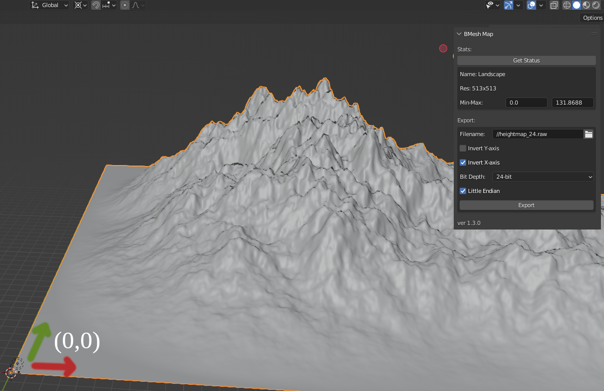

# Blender Mesh to RAW file Exporter

Exports your selected object's mesh as a heightmap `.raw` file with
* 16-bit or 24-bit unsigned integer value
* endianness: little or big

Works well with [Zylann's Heightmap Plugin](https://github.com/Zylann/godot_heightmap_plugin)

## Installation

Download the file and install like any Blender Add-on.

Verified Compatibility
| Add-on Version | Blender Versions |
| --------------- | --------------- |
| 1.3             | 3.3             |
| 1.2             | 3.3             |
| 1.1             | 3.3             |
| 1.0             | 3.3             |

## Usage

[Documentation](docs/README.md)

## Restrictions

To get any heightmap, respect the following
* The Add-on works in Object Space and all vertices on x- and y-axis must be positive, that means the Object origin must be at the bottom left of your map (as seen from top view).
  * Simplest setup: Your Object Origin is at World Origin and the map's vertices are all on the positive x- and y-axis (where each vertex has an axis-position >= 0).
* The Object's Dimensions (width and depth on x- and y-axis) must be equal in size.
  * should be a power of 2 number, e.g. 128x128, 256x256, 512x512, 1024x1024, etc.
* The Object Mesh' vertex count should create a resolution of power of 2 plus 1 (e.g. 129x129, etc.)
  * The Add-on shows you the Mesh' resolution in its Panel at `Res`.

To get an accurate heightmap,
* your vertices should be on full meters (float values should equal their integer representation), i.e. the vertices should be on the Blender Grid
  * a simple check: Set `Viewport Shading` to `Wireframe` and look orthogonal from above. Mesh vertices should align perfectly with Blender Grid
