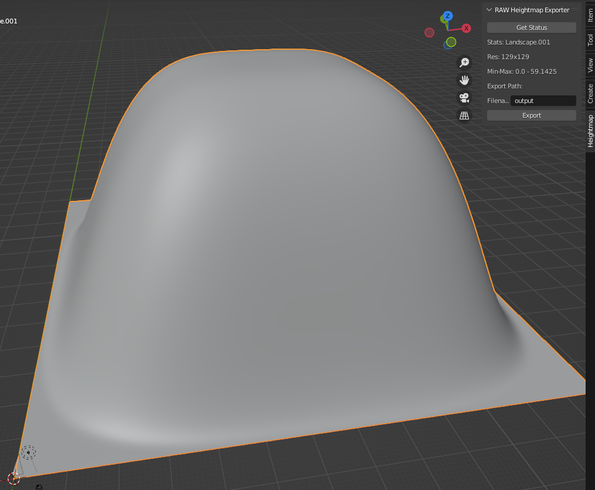
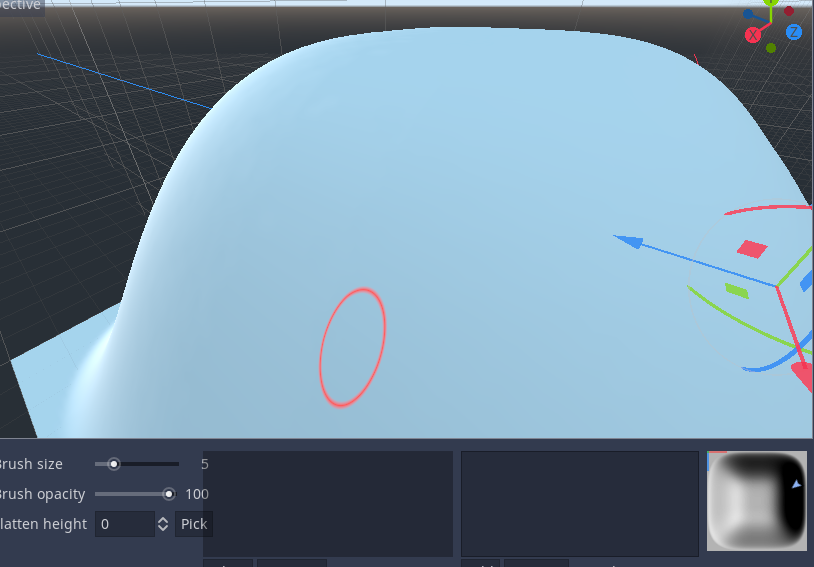

# How-to

## Blender

Example Process
* Create a new A.N.T. Landscape (_install the A.N.T. addon if not already done so_) and set
  * Mesh Size to 128x128, and
  * Subdivision to 129x129 (_NOTE_: subdivision must always be 1 higher)
    * **this value is the resolution (power of 2 + 1)**
* While in `Object Mode`, open the `Heightmap`-tools-tab,
  * click `Get Status`: shows you info on your Mesh: check your resolution and note down your min and max values (i.e. the lowest and highest vertex)
  * set a Filename: it will be saved in the same directory as your blend file
  * **for Godot (Zylann's Heightmap Plugin)**: make sure that `Invert X-axis` is toggled, else your map is mirrored on the x-axis
  * click `Export` and you get your mesh as a heightmap file (`.raw`)
* Done

## Godot

In Godot, with Zylann's Heightmap Plugin, you import your `.raw` file like `.png`, `.exr`, etc.

Import settings
* Raw Endianess: `Little Endian`
* `Min Height` + `Max Height`: take them from the Add-on Panel in Blender, see `Min-Max`.

Enjoy the round- and fluffyness!
