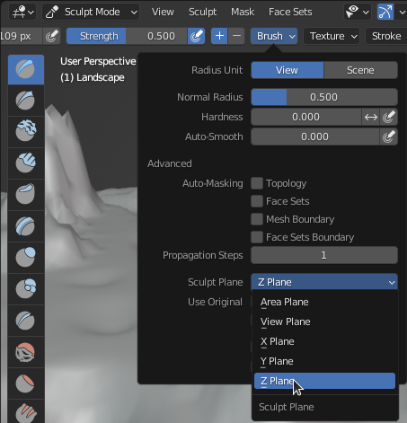

# How-to

workflow examples
* [OpenEXR file](exr-example.md)
* [RAW file](raw-example.md)

## Adanced Tips in Blender

### Correct Sculpting

If you want to correctly sculpt the terrain, you must only change the vertices' height values (i.e. affect their position on the z plane).  
To achieve this, enter Sculpt Mode, then go to `Brush > Sculpt Plane` and change the value to `Z Plane`:

Which standard brushes respect this choice?
* **Draw**
* **Draw Sharp**
* **Clay**
* **Clay Strips**
* **Layer**
* **Crease**
* **Flatten**
* **Fill**
* **Scrape**

Which don't?
* Clay Thumb (plane can be set, but seems to be ignored)
* Inflate
* Blob (plane can be set, but seems to be ignored)
* **Smooth** (but should be safe to use)
* Multi-plane Scrape (plane can be set, but seems to be ignored)
* Pinch
* Grab

TODO:
* continue testing with Elastic Deform
