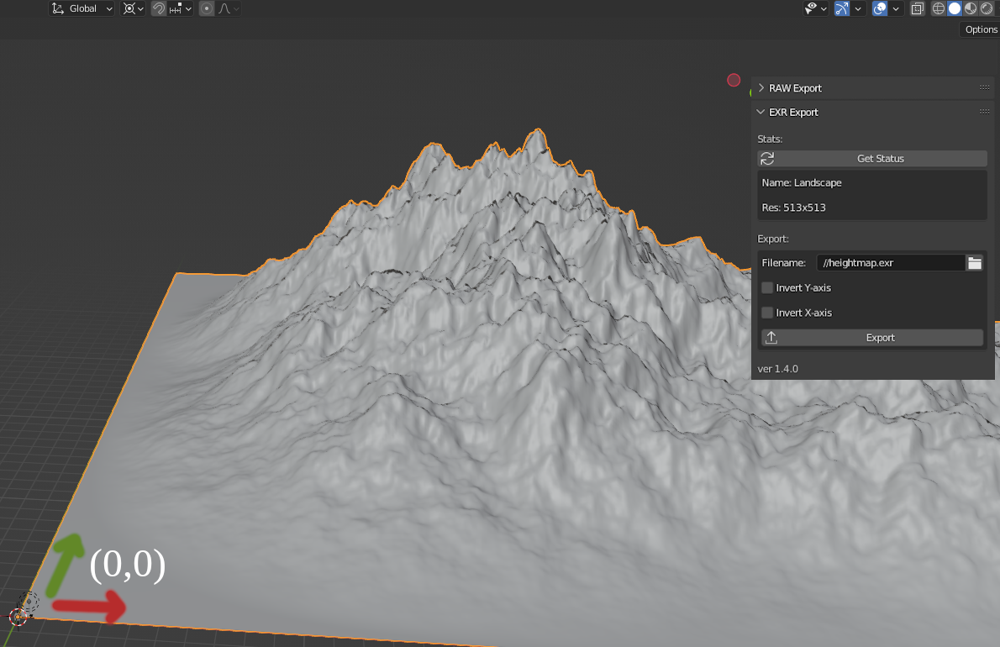

## Simple Workflow Example

**Blender**

* Create a new A.N.T. Landscape (_install the A.N.T. addon if not already done so_) and set
  * Mesh Size to 128x128, and
  * Subdivision to 129x129 (_NOTE_: subdivision must always be 1 higher)
    * **this value is the resolution (power of 2 + 1)**
* While in `Object Mode`, open the `BMesh Map`-tools-tab,
  * clicking on `Get Status` gives you feedback on your Mesh: check your resolution and copy your min and max height values,
  * specify the location and filename to save to
  * click `Export` and you get your mesh as a 32-bit `.exr` file with the height info stored in the image's _red channel_.
* Done

**Godot**

In Godot, with Zylann's Heightmap Plugin, you import your `.exr` as documented in the official docs.

**Use the `godot4` branch** to actually use heightmaps with 32-bit precision!

Enjoy the beautiful export!