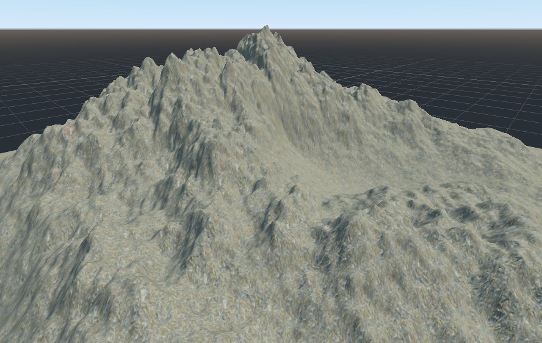

## Simple Workflow Example

**Blender**

* Create a new A.N.T. Landscape (_install the A.N.T. addon if not already done so_) and set
  * Mesh Size to 128x128, and
  * Subdivision to 129x129 (_NOTE_: subdivision must always be 1 higher)
    * **this value is the resolution (power of 2 + 1)**
* While in `Object Mode`, open the `BMesh Map`-tools-tab,
  * clicking on `Get Status` gives you feedback on your Mesh: check your resolution and copy your min and max height values,
  * specify the location and filename to save to
  * choose your bit-depth
    * 24-bit (better for maps with high difference between min and max value ([1](https://github.com/Zylann/godot_heightmap_plugin/issues/340#issuecomment-1222655581), [2: slide 17](https://www.gdcvault.com/play/1025480/Terrain-Rendering-in-Far-Cry)))
    * 16-bit
  * choose your endianness (default: little)
  * click `Export` and you get your mesh as a heightmap file (`.raw`)
* Done

**Godot**

In Godot, with Zylann's Heightmap Plugin, you import your `.raw` file like `.png`, `.exr`, etc.

Import settings
* Raw Endianess: The one you chose on your export
* godot4 branch:
  * Once [this PR](https://github.com/Zylann/godot_heightmap_plugin/pull/369) is merged, you can import 24-bit raw files. Bit-depth is auto-detected.
* main branch (for Godot 3.x)
  * expects 16-bit raw file; **does not support 24-bit import!**
* `Min Height` + `Max Height`: take them from the Add-on Panel in Blender, see `Min-Max`.

Enjoy the beautiful export!